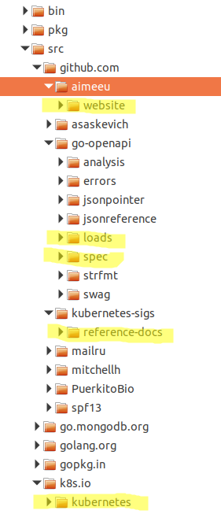

# Manually generate API and kubectl reference docs

## Prerequisites

1. Golang version that is [supported](https://github.com/kubernetes/community/blob/master/contributors/devel/development.md#go) by Kubernetes; currently Golan v1.12.x
2. Git
3. Hugo 57.2 OR Docker for building and testing the website locally
4. Your kubernetes/website fork is up to date with upstream/master

## Create Go workspace and set GOPATH
This presumes you start in your HOME directory.
```bash
mkdir ref-docs-gen
cd ref*
mkdir src
export GOPATH=$HOME/ref-docs-gen/src
echo $GOPATH
```


## Generate API reference docs

### Clone repos
```bash
go get -u github.com/go-openapi/loads
go get -u github.com/go-openapi/spec
go get -u github.com/kubernetes-sigs/reference-docs
git clone https://github.com/aimeeu/website $GOPATH/src/github.com/aimeeu/website
git clone https://github.com/kubernetes/kubernetes $GOPATH/src/k8s.io/kubernetes
```



### Update kubernetes-sigs/reference-docs makefile
Update WEBROOT, K8SROOT, AND MINOR_VERSION.

```yaml
WEBROOT=~/ref-docs-gen/src/github.com/aimeeu/website
K8SROOT=~/ref-docs-gen/src/github.com/k8s.io/kubernetes
MINOR_VERSION=16
```

### Make the docs

Change to the kubernetes-sigs/reference-docs directory. Run ```make updateapispec```.

Output is
```
cp ~/ref-docs-gen/src/k8s.io/kubernetes/api/openapi-spec/swagger.json gen-apidocs/generators/openapi-spec/swagger.json
```

Run ```make api```.

The first few lines of out are similar to:
```
sudo rm -rf /home/aimee/ref-docs-gen/src/github.com/kubernetes-sigs/reference-docs/gen-apidocs/generators/build
[sudo] password for aimee:
sudo rm -rf /home/aimee/ref-docs-gen/src/github.com/kubernetes-sigs/reference-docs/gen-apidocs/generators/includes
go run gen-apidocs/main.go --config-dir=gen-apidocs/generators --munge-groups=false
Current Version: apiextensions.v1.CustomResourceDefinitionCondition Old Versions: [apiextensions.v1beta1.CustomResourceDefinitionCondition,]
Current Version: rbac.v1.RoleRef Old Versions: [rbac.v1beta1.RoleRef,rbac.v1alpha1.RoleRef,]
```

Verify nav files have been created by running:

```
[ -e "gen-apidocs/generators/build/index.html" ] && echo "index.html built" || echo "no index.html"
```

and

```
[ -e "gen-apidocs/generators/build/navData.js" ] && echo "navData.js built" || echo "no navData.js"
```

Create a v1.<MINOR_VERSION> directory in website/static/docs/reference/generated/kubernetes-api

Copy files to website directory by running ```make copyapi```.

Change to the website directory. Run ```git status``` to see the new and updated files. Output is similar to:

```
Changes not staged for commit:
  (use "git add <file>..." to update what will be committed)
  (use "git checkout -- <file>..." to discard changes in working directory)

	modified:   content/en/docs/reference/_index.md
	modified:   content/en/docs/reference/kubernetes-api/index.md

Untracked files:
  (use "git add <file>..." to include in what will be committed)

	static/docs/reference/generated/kubernetes-api/v1.16/

no changes added to commit (use "git add" and/or "git commit -a")
```

### Manually update the minor version in the API reference index page

File: ```website/content/en/docs/reference/kubernetes-api/index.md```

```
---
title: v1.16
---

[Kubernetes API v1.16](/docs/reference/generated/kubernetes-api/v1.16/)
```

### Manually add link to new version of API Docs

File:  ```website/content/en/docs/reference/_index.md```

Add a new line in the ```## API Reference``` section. Remove the oldest version.

```
* [Kubernetes API Overview](/docs/reference/using-api/api-overview/) - Overview of the API for Kubernetes.
* Kubernetes API Versions
  * [1.16](/docs/reference/generated/kubernetes-api/v1.16/)
  * [1.15](/docs/reference/generated/kubernetes-api/v1.15/)
  * [1.14](/docs/reference/generated/kubernetes-api/v1.14/)
  * [1.13](/docs/reference/generated/kubernetes-api/v1.13/)
  * [1.12](/docs/reference/generated/kubernetes-api/v1.12/)
```

## Genereate kubectl reference docs

### Clone repos
Change to ```$HOME/ref-docs-gen/src```.

```
go get -u github.com/spf13/pflag
go get -u github.com/spf13/cobra
go get -u gopkg.in/yaml.v2
```

### Remove the spf13 package from k8s.io/kubernetes

```
rm -rf k8s.io/kubernetes/vendor/github.com/spf13
```

### Create <MINOR_VERSION> directory

Change to the ```kubernetes-sigs/reference-docs/gen-kubectldocs/generators```
directory. Create a new ```<MINOR_VERSION>``` directory based on the most recent
minor version.

```
mkdir gen-kubectldocs/generators/v1_16
cp -r gen-kubectldocs/generators/v1_15/* gen-kubectldocs/generators/v1_16
```

### Make the docs

Run ```make copycli```.

The first several lines of output are similar to:

```
sudo rm -f main
[sudo] password for aimee:
sudo rm -rf /home/aimee/ref-docs-gen/src/github.com/kubernetes-sigs/reference-docs/gen-kubectldocs/generators/includes
sudo rm -rf /home/aimee/ref-docs-gen/src/github.com/kubernetes-sigs/reference-docs/gen-kubectldocs/generators/build
sudo rm -rf /home/aimee/ref-docs-gen/src/github.com/kubernetes-sigs/reference-docs/gen-kubectldocs/generators/manifest.json
go run gen-kubectldocs/main.go --kubernetes-version v1_16
docker run -v /home/aimee/ref-docs-gen/src/github.com/kubernetes-sigs/reference-docs/gen-kubectldocs/generators/includes:/source -v /home/aimee/ref-docs-gen/src/github.com/kubernetes-sigs/reference-docs/gen-kubectldocs/generators/build:/build -v /home/aimee/ref-docs-gen/src/github.com/kubernetes-sigs/reference-docs/gen-kubectldocs/generators/:/manifest pwittrock/brodocs
Unable to find image 'pwittrock/brodocs:latest' locally
latest: Pulling from pwittrock/brodocs
386a066cd84a: Pull complete
75ea84187083: Pull complete
88b459c9f665: Pull complete
```

Verify nav files have been created by running:

```
[ -e "gen-kubectldocs/generators/build/index.html" ] && echo "index.html built" || echo "no index.html"
index.html built
```

and

```
[ -e "gen-kubectldocs/generators/build/navData.js" ] && echo "navData.js built" || echo "no navData.js"
navData.js built
```

Change to the website directory. Run ```git status``` to see the new and updated files. Output is similar to:

```
Changes to be committed:
  (use "git reset HEAD <file>..." to unstage)

	modified:   content/en/docs/reference/_index.md
	modified:   content/en/docs/reference/kubernetes-api/index.md
	new file:   static/docs/reference/generated/kubernetes-api/v1.16/css/bootstrap.min.css
	new file:   static/docs/reference/generated/kubernetes-api/v1.16/css/font-awesome.min.css
	new file:   static/docs/reference/generated/kubernetes-api/v1.16/css/stylesheet.css
	new file:   static/docs/reference/generated/kubernetes-api/v1.16/fonts/FontAwesome.otf
	new file:   static/docs/reference/generated/kubernetes-api/v1.16/fonts/fontawesome-webfont.eot
	new file:   static/docs/reference/generated/kubernetes-api/v1.16/fonts/fontawesome-webfont.svg
	new file:   static/docs/reference/generated/kubernetes-api/v1.16/fonts/fontawesome-webfont.ttf
	new file:   static/docs/reference/generated/kubernetes-api/v1.16/fonts/fontawesome-webfont.woff
	new file:   static/docs/reference/generated/kubernetes-api/v1.16/fonts/fontawesome-webfont.woff2
	new file:   static/docs/reference/generated/kubernetes-api/v1.16/index.html
	new file:   static/docs/reference/generated/kubernetes-api/v1.16/jquery.scrollTo.min.js
	new file:   static/docs/reference/generated/kubernetes-api/v1.16/navData.js
	new file:   static/docs/reference/generated/kubernetes-api/v1.16/scroll.js

Changes not staged for commit:
  (use "git add <file>..." to update what will be committed)
  (use "git checkout -- <file>..." to discard changes in working directory)

	modified:   static/docs/reference/generated/kubectl/kubectl-commands.html
	modified:   static/docs/reference/generated/kubectl/navData.js
	modified:   static/docs/reference/generated/kubectl/node_modules/jquery/dist/jquery.min.js
```

## Test website locally if desired

Run ```hugo server```.
