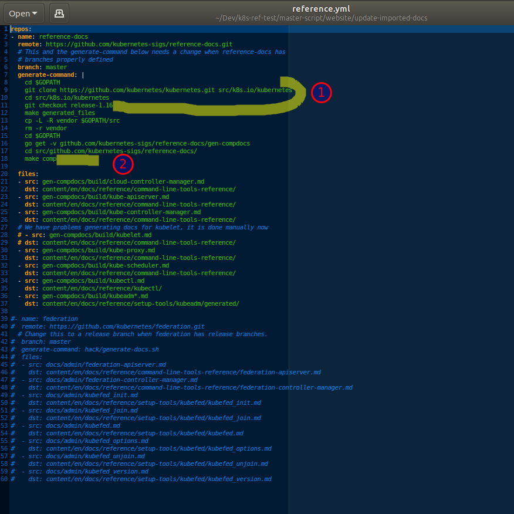

# Use update-imported-docs.py to generate API and kubectl reference docs

## Prerequisites

1. Golang version that is [supported](https://github.com/kubernetes/community/blob/master/contributors/devel/development.md#go) by Kubernetes (currently Golan v1.12.x); the Golang binary must be in your PATH
2. Git
3. Python 3.x (creation of a virtual environment recommended)
4. Hugo 57.2 OR Docker for building and testing the website locally
5. Your `kubernetes/website` fork is up to date with upstream/master

## Clone the website repo

```
git clone git@github.com:aimeeu/website.git
```

## Update the reference.yml file

Change to the `website/update-imported-docs` directory.

1. Either change `git checkout release-1.16` to the release you want (e.g. 1.17) OR replace those three lines with:

   ```
   git clone --single-branch --branch release-1.17 https://github.com/kubernetes/kubernetes.git src/k8s.io/kubernetes
   cd src/k8s.io/Kubernetes
   ```
2. The `update-imported-docs.py` script does not create the directories for style sheets and other static content; nor does it copy that content from the `kubernetes-sigs/reference-docs` directory. Solve this by adding `make copyapi` and `make copycli` after `make comp`.



