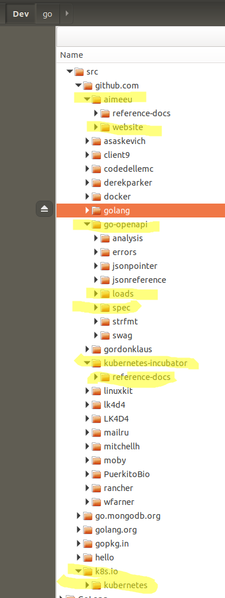

# General thought bubble before digging in

- Why isn't api doc generation done as part of a CI/CD merge process for a project? probably not possible in current environment - what about moving API docs to separate website? too much overhead?
- Flaw: Kubernetes website doesn't have a 'latest' like ReadTheDocs does, so does v1.16 docs == master. Really, docs github branch v1.16 should equal rendered website documentation v1.16; website docs should have a 'latest' choice that equals 'master' content (or haven't I yet stumbled upon how this is done? Netlify, right?)
- jenkins, travis CI, or ?
- https://github.com/kubernetes-incubator/reference-docs/blob/master/gen-apidocs/generators/static/bootstrap.min.css -- can we point to a CDN istead?

# Sites
- https://swagger.io
- https://github.com/OAI/OpenAPI-Specification
- https://swagger.io/docs/specification/about/
- https://swagger.io/specification/
- https://github.com/go-openapi

# Reference docs overview
1. [Contributing to the Upstream Kubernetes Code](https://kubernetes.io/docs/contribute/generate-ref-docs/contribute-upstream/)
2. [Generating Reference Documentation for kubectl Commands](https://kubernetes.io/docs/contribute/generate-ref-docs/kubectl/)
3. [Generating Reference Documentation for the Kubernetes API](https://kubernetes.io/docs/contribute/generate-ref-docs/kubernetes-api/)
4. [Generating Reference Pages for Kubernetes Components and Tools](https://kubernetes.io/docs/contribute/generate-ref-docs/kubernetes-components/)

# Repo
https://github.com/kubernetes-incubator/reference-docs  @pwittrock and @tengqm are top contributors; @kbhawkey very knowledgeable

Repo will soon move to kubernetes-sigs space. https://github.com/kubernetes/org/issues/1158

# The GitHub Issues
The Docs Lead is responsible for generating:

- K8s API reference
- Kube Components
- Kubectl

Master issue:
- [15682 Discover the scope and requirements to refactor the K8s docs API generation process](https://github.com/kubernetes/website/issues/15682)

Linked issues:
- [14111 Update /docs/contribute/generate-ref-docs](https://github.com/kubernetes/website/issues/14111)

  - comment shorthand cheat of how @jimangel generated the API docs: [13462 API Reference for 1.14](https://github.com/kubernetes/website/pull/13462#issuecomment-476944536) -> this was closed in favor of [13442 API reference for 1.14](https://github.com/kubernetes/website/pull/13442), which updates stylesheets in static/docs/reference/generated/kubernetes-api/v1.14
  - comment shorthand cheat of how @jimangel generated the components [13465 Reference documentation for kube components ](https://github.com/kubernetes/website/pull/13465#issuecomment-476959426) this PR closed in favor of [13444 Reference documentation for kube components](https://github.com/kubernetes/website/pull/13444)
  - @kbhawkey [updated the api reference contrib doc](https://github.com/kubernetes/website/pull/15114)
  - [13396 Tracking issues with generating reference docs v1.14](https://github.com/kubernetes/website/issues/13396) - @makoscafee [notes](https://github.com/kubernetes/website/issues/13396#issuecomment-505275466) that 1.15 ref docs generated but no clear process

Related issues with good info:
- [15536 Documentation should explicitly mention which values are required/optional](https://github.com/kubernetes/website/issues/15536)

# Slack threads
- aimee and Jim Angel 9/26/19
- v1.16 issue with publishe API docs including wrong js/bootstrap version (now fixed in ref-docs repo) https://kubernetes.slack.com/archives/C1J0BPD2M/p1569439245104900
- https://kubernetes.slack.com/archives/C1J0BPD2M/p1569496753120100, https://kubernetes.slack.com/archives/C1J0BPD2M/p1569504098122000, https://kubernetes.slack.com/archives/C1J0BPD2M/p1569504118122700 -- which API versions are supported in which releases

# Generating API Docs Documentation
- Release Handbook [Late Steps](https://github.com/kubernetes/sig-release/tree/master/release-team/role-handbooks/docs#late-steps-weeks-9-11)
- Instructions in issue [#14111](https://github.com/kubernetes/website/issues/14111)

# Generate Ref docs
## Generate manually
using instructions in contribute/generate-ref-docs https://kubernetes.io/docs/contribute/generate-ref-docs/kubernetes-api/
### Clone repos
make sure my fork is current with upstream

```shell
aimee@aimee-lemur:~/Dev/go$ go get -u github.com/kubernetes-incubator/reference-docs
aimee@aimee-lemur:~/Dev/go$ go get -u github.com/go-openapi/loads
aimee@aimee-lemur:~/Dev/go$ go get -u github.com/go-openapi/spec
aimee@aimee-lemur:~/Dev/go$ git clone https://github.com/aimeeu/website $GOPATH/src/github.com/aimeeu/website
fatal: destination path '/home/aimee/Dev/go/src/github.com/aimeeu/website' already exists and is not an empty directory.
aimee@aimee-lemur:~/Dev/go$ git clone https://github.com/aimeeu/website $GOPATH/src/github.com/aimeeu/website
Cloning into '/home/aimee/Dev/go/src/github.com/aimeeu/website'...
remote: Enumerating objects: 19, done.
remote: Counting objects: 100% (19/19), done.
remote: Compressing objects: 100% (17/17), done.
remote: Total 116641 (delta 6), reused 9 (delta 2), pack-reused 116622
Receiving objects: 100% (116641/116641), 236.39 MiB | 27.13 MiB/s, done.
Resolving deltas: 100% (76178/76178), done.
aimee@aimee-lemur:~/Dev/go$ git clone https://github.com/kubernetes/kubernetes $GOPATH/src/k8s.io/kubernetes
Cloning into '/home/aimee/Dev/go/src/k8s.io/kubernetes'...
remote: Enumerating objects: 340, done.
remote: Counting objects: 100% (340/340), done.
remote: Compressing objects: 100% (206/206), done.
remote: Total 1009646 (delta 174), reused 156 (delta 134), pack-reused 1009306
Receiving objects: 100% (1009646/1009646), 670.85 MiB | 27.67 MiB/s, done.
Resolving deltas: 100% (709662/709662), done.
Checking out files: 100% (21030/21030), done.

```


### Manually modify reference-docs makefile

Update the makefile with local directories:
```
WEBROOT=~/Dev/go/src/github.com/aimeeu/website
K8SROOT=~/Dev/go/src/k8s.io/kubernetes
MINOR_VERSION=16
```

### Generate API Docs

Run ```updateapispec```
```shell
aimee@aimee-lemur:~/Dev/go/src/github.com/kubernetes-incubator/reference-docs$ make updateapispec
cp ~/Dev/go/src/k8s.io/kubernetes/api/openapi-spec/swagger.json gen-apidocs/generators/openapi-spec/swagger.json
```

Run ```make apidocs``` (why does ```cleanapi``` require sudo??? shouldn't!!! neither should ```cleancli```)
```shell
aimee@aimee-lemur:~/Dev/go/src/github.com/kubernetes-incubator/reference-docs$ make api
sudo rm -rf /home/aimee/Dev/go/src/github.com/kubernetes-incubator/reference-docs/gen-apidocs/generators/build
[sudo] password for aimee:
sudo rm -rf /home/aimee/Dev/go/src/github.com/kubernetes-incubator/reference-docs/gen-apidocs/generators/includes
go run gen-apidocs/main.go --config-dir=gen-apidocs/generators --munge-groups=false

..... plus lots more output
```

Verify files have been generated:
```shell
aimee@aimee-lemur:~/Dev/go/src/github.com/kubernetes-incubator/reference-docs$ [ -e "gen-apidocs/generators/build/index.html" ] && echo "index.html built" || echo "no index.html"
index.html built
aimee@aimee-lemur:~/Dev/go/src/github.com/kubernetes-incubator/reference-docs$ [ -e "gen-apidocs/generators/build/navData.js" ] && echo "navData.js built" || echo "no navData.js"
navData.js built
```

### Copying the generated docs to the kubernetes/website repository

```shell
aimee@aimee-lemur:~/Dev/go/src/github.com/kubernetes-incubator/reference-docs$ make copyapi
cp gen-apidocs/generators/build/index.html ~/Dev/go/src/github.com/aimeeu/website/static/docs/reference/generated/kubernetes-api/v1.16/index.html
cp gen-apidocs/generators/build/navData.js ~/Dev/go/src/github.com/aimeeu/website/static/docs/reference/generated/kubernetes-api/v1.16/navData.js
cp gen-apidocs/generators/static/scroll.js ~/Dev/go/src/github.com/aimeeu/website/static/docs/reference/generated/kubernetes-api/v1.16/scroll.js
mkdir -p ~/Dev/go/src/github.com/aimeeu/website/static/docs/reference/generated/kubernetes-api/v1.16/css
cp gen-apidocs/generators/static/stylesheet.css ~/Dev/go/src/github.com/aimeeu/website/static/docs/reference/generated/kubernetes-api/v1.16/css/stylesheet.css
cp gen-apidocs/generators/static/bootstrap.min.css ~/Dev/go/src/github.com/aimeeu/website/static/docs/reference/generated/kubernetes-api/v1.16/css/bootstrap.min.css
cp gen-apidocs/generators/static/jquery.scrollTo.min.js ~/Dev/go/src/github.com/aimeeu/website/static/docs/reference/generated/kubernetes-api/v1.16/jquery.scrollTo.min.js
cp gen-apidocs/generators/static/font-awesome.min.css ~/Dev/go/src/github.com/aimeeu/website/static/docs/reference/generated/kubernetes-api/v1.16/css/font-awesome.min.css
mkdir -p ~/Dev/go/src/github.com/aimeeu/website/static/docs/reference/generated/kubernetes-api/v1.16/fonts
cp gen-apidocs/generators/static/FontAwesome.otf ~/Dev/go/src/github.com/aimeeu/website/static/docs/reference/generated/kubernetes-api/v1.16/fonts/FontAwesome.otf
cp gen-apidocs/generators/static/fontawesome-webfont.eot ~/Dev/go/src/github.com/aimeeu/website/static/docs/reference/generated/kubernetes-api/v1.16/fonts/fontawesome-webfont.eot
cp gen-apidocs/generators/static/fontawesome-webfont.svg ~/Dev/go/src/github.com/aimeeu/website/static/docs/reference/generated/kubernetes-api/v1.16/fonts/fontawesome-webfont.svg
cp gen-apidocs/generators/static/fontawesome-webfont.ttf ~/Dev/go/src/github.com/aimeeu/website/static/docs/reference/generated/kubernetes-api/v1.16/fonts/fontawesome-webfont.ttf
cp gen-apidocs/generators/static/fontawesome-webfont.woff ~/Dev/go/src/github.com/aimeeu/website/static/docs/reference/generated/kubernetes-api/v1.16/fonts/fontawesome-webfont.woff
cp gen-apidocs/generators/static/fontawesome-webfont.woff2 ~/Dev/go/src/github.com/aimeeu/website/static/docs/reference/generated/kubernetes-api/v1.16/fonts/fontawesome-webfont.woff2

aimee@aimee-lemur:~/Dev/go/src/github.com/kubernetes-incubator/reference-docs$ cd ../../aimeeu/website
aimee@aimee-lemur:~/Dev/go/src/github.com/aimeeu/website$

aimee@aimee-lemur:~/Dev/go/src/github.com/aimeeu/website$ git status
On branch master
Your branch is up to date with 'origin/master'.

Changes not staged for commit:
  (use "git add <file>..." to update what will be committed)
  (use "git checkout -- <file>..." to discard changes in working directory)

	modified:   static/docs/reference/generated/kubernetes-api/v1.16/index.html
	modified:   static/docs/reference/generated/kubernetes-api/v1.16/navData.js

no changes added to commit (use "git add" and/or "git commit -a")

```

### Manually update the API reference index page
Update the API reference version number - this is the .dot version that is set in the Makefile

```shell
aimee@aimee-lemur:~/Dev/go/src/github.com/aimeeu/website$ cd content/en/docs/reference/kubernetes-api
aimee@aimee-lemur:~/Dev/go/src/github.com/aimeeu/website/content/en/docs/reference/kubernetes-api$ cat index.md
---
title: v1.16
---

[Kubernetes API v1.16](/docs/reference/generated/kubernetes-api/v1.16/)
```

### Manually add link to new version of ref docs

Open ```<web-base>/content/en/docs/reference/_index.md``` for editing, and add a new link for the latest API reference. Remove the oldest API reference version. There should be five links to the most recent API references.

```shell
aimee@aimee-lemur:~/Dev/go/src/github.com/aimeeu/website/content/en/docs/reference/kubernetes-api$ cd ../
aimee@aimee-lemur:~/Dev/go/src/github.com/aimeeu/website/content/en/docs/reference$ cat _index.md
---
title: Reference
approvers:
- chenopis
linkTitle: "Reference"
main_menu: true
weight: 70
content_template: templates/concept
---

{}

This section of the Kubernetes documentation contains references.

{}

{}

## API Reference
* [Kubernetes API Overview](/docs/reference/using-api/api-overview/) - Overview of the API for Kubernetes.
* Kubernetes API Versions
  * [1.16](/docs/reference/generated/kubernetes-api/v1.16/)
  * [1.15](/docs/reference/generated/kubernetes-api/v1.15/)
  * [1.14](/docs/reference/generated/kubernetes-api/v1.14/)
  * [1.13](/docs/reference/generated/kubernetes-api/v1.13/)
  * [1.12](/docs/reference/generated/kubernetes-api/v1.12/)
```

### Test locally

```shell
aimee@aimee-lemur:~/Dev/go/src/github.com/aimeeu/website$ hugo serve
```

or use ```make docker-serve``` although I got a 'pull access denied for kubernetes-hugo' repo

## Automate process

- create bash script (or python or go??) that takes in k8s_base, web_base, rdocs_base, minor_version, github_username
- git clone https://github.com/<your-username>/website $GOPATH/src/github.com/<your-username>/website  IS WRONG WRONG WRONG - use git clone git@github.com:<github_username>/website so SSH is used to push the PR at the end
- after cloning k/website, checkout branch
- remove sudo from cleanapi and cleancli targets
- modify reference-docs/makefile to take in parameters? web_base, k8s_base, minor_version  OR rename Makefile to Makefile.orig and use sed to update and stream results to Makefile
- how to modify ```<web-base>/content/en/docs/reference/_index.md```  ????
